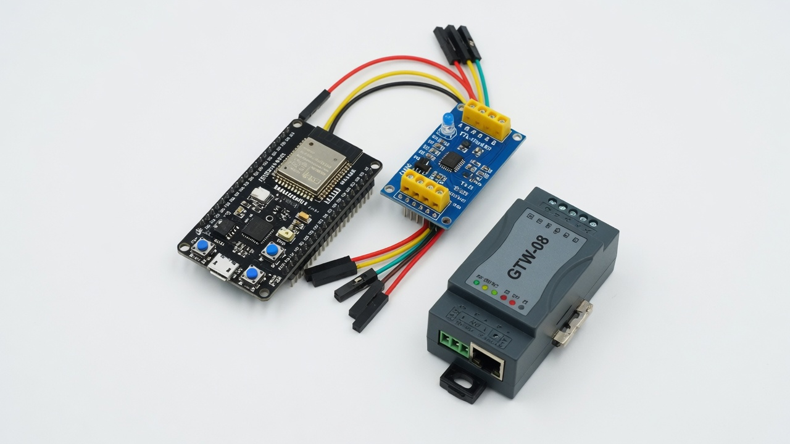
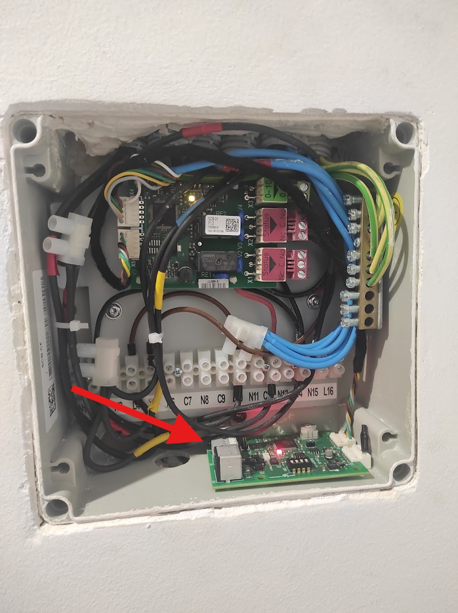
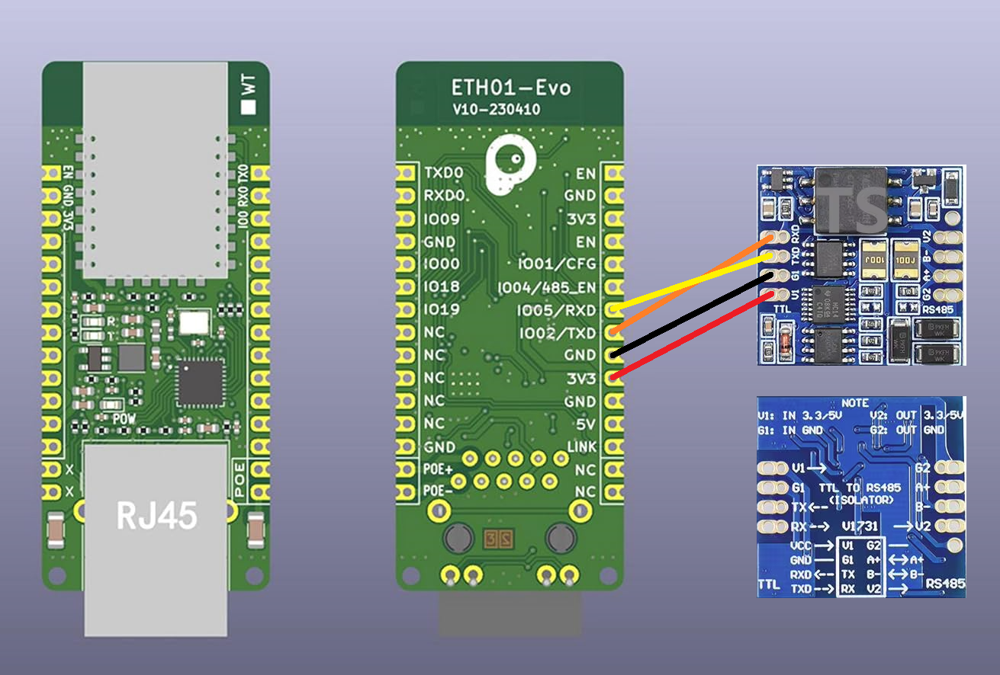

# ESP32 + GTW-08 — pompe à chaleur Remeha / Intergas / Baxi / Brötje

Firmware [ESPHome](https://esphome.io/) pour lire et piloter une pompe à chaleur (ou chaudière Ace) via la passerelle **Modbus RTU GTW-08**, depuis [Home Assistant](https://www.home-assistant.io/).

<p align="center">
  
</p>

La config expose températures, pression, état PAC / ECS / froid, consigne, courbe de chauffe, et des switchs (chauffage, ECS, froid).

---

## À quoi ça sert

Sans cette passerelle, la PAC n’est parlante que via le cloud constructeur. Le **GTW-08** sort un bus **Modbus RTU (RS-485)**. L’ESP32 le relie au Wi‑Fi et à l’API native Home Assistant (local, sans cloud).

Cas d’usage :

- tableau de bord (départ / retour, delta T, extérieur, ballon ECS)
- coupure chauffage / ECS selon tarif, présence ou PV
- alerte pression d’eau basse, défaut, besoin de service
- consigne pièce, pente de courbe, consigne ECS depuis HA

Compatible avec les produits **Ace** (T-Control / S-Control) qui acceptent un GTW-08 : Remeha Elga Ace, Mercuria Ace, Eria Tower, Intergas, Baxi, Brötje, De Dietrich… (même famille BDR Thermea).

---

## Matériel

| Élément | Rôle | Lien |
| --- | --- | --- |
| **GTW-08** (Remeha 7721982 / ML638) | Convertit le bus interne en Modbus RTU | [Fiche produit](https://www.alternative-haustechnik.de/remeha-schnittstelle-modbus-rtu-gateway-gtw-08/7721982) · [Amazon](https://www.amazon.co.uk/Remeha-Modbus-interface-Gateway-GTW-08/dp/B0971GM23N) |
| **ESP32 DevKit** | Wi‑Fi + UART | n’importe quel ESP32 30 broches |
| **MAX485 / TTL-RS485** | UART 3,3 V → RS-485 | module 3,3 V (pas un 5 V seul) |
| Alim 5 V USB | ESP32 | — |
| Paire torsadée | A / B Modbus | câble alarme / bus, 2 fils |

Doc constructeur : [configuratiehandleiding GTW-08 (PDF)](https://tools.remeha.nl/wp-content/uploads/sites/11/2024/07/configuratiehandleiding-GTW-08.pdf).

Projets proches :

- [Imanol82 — Baxi/Dietrich/Remeha → ESP32](https://github.com/Imanol82/Baxi-Dietrich-Remeha-to-Home-Assistant-with-an-ESP32)
- [houthacker/remeha-modbus](https://github.com/houthacker/remeha-modbus) (Modbus TCP, autre chemin)

<p align="center">
  
</p>

*Exemple d’installation du module dans le tableau de la PAC (crédit : projet Imanol82).*

---

## Câblage

Modbus de cette config :

| Paramètre | Valeur |
| --- | --- |
| Vitesse | **9600** 8N1 |
| Slave | **0x64 (100)** — molette du GTW-08 |
| ESP32 TX | **GPIO17** → DI / TX du MAX485 |
| ESP32 RX | **GPIO16** → RO / RX du MAX485 |
| MAX485 A / B | bornes A / B du GTW-08 |
| MAX485 VCC / GND | 3,3 V et GND ESP32 |
| DE+RE | souvent reliés à 3,3 V (émission permanente) ou à un GPIO si le module l’exige |

```
PAC Ace  --(bus interne)-->  GTW-08  --RS-485 A/B-->  MAX485  --UART-->  ESP32  --Wi-Fi-->  Home Assistant
```

<p align="center">
  
</p>

*Schéma de référence (projet Imanol82). Ici TX=GPIO17, RX=GPIO16, baud 9600, slave 100.*

Si rien ne répond : inverser **A et B**, vérifier l’adresse (molette = 100), et que le GTW-08 est bien alimenté par le bus interne de la PAC.

---

## Installation ESPHome

1. Installer [ESPHome](https://esphome.io/) (add-on HA ou CLI).
2. Copier `esp32-pac.yaml` et `secrets.yaml.example` → `secrets.yaml`.
3. Remplir Wi‑Fi, mot de passe OTA, hotspot, et une clé API :

```bash
openssl rand -base64 32
```

4. Premier flash en USB, ensuite OTA.

```bash
esphome run esp32-pac.yaml
```

5. Dans Home Assistant : **Paramètres → Appareils → Ajouter → ESPHome** (découverte auto).

---

## Entités exposées

**Capteurs :** puissance %, T° extérieure, départ / retour PAC, delta T, ballon ECS, consigne ECS, T° pièce, consigne chauffage, pression d’eau, vitesse circulateur, code défaut.

**Binaires :** PAC on, appoint 1/2, appoint ECS, service, pression basse, défaut, CH / ECS / froid actifs, pompes.

**Commandes :** activer chauffage / ECS / froid ; consigne pièce ; pente et pied de courbe ; consigne ECS ; hystérésis ; modes chauffage / ECS (programme, manuel, hors-gel) ; T° extérieure de coupure.

Les adresses Modbus suivent la table GTW-08 (holding). Ne change le slave / le baud que si ta molette n’est pas sur 100.

---

## Licence

MIT — voir `LICENSE`.
Le GTW-08, Remeha, Intergas, Baxi et Brötje restent des marques de leurs propriétaires.
